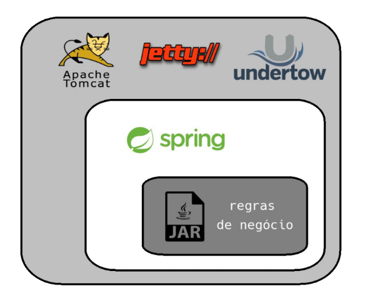
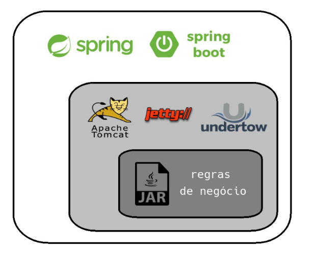

# Aula 3 - Arquitetura WEB e REST API`s 

## Introdução 
---
### Web vs Desktop

- Desktop: são aquelas acessadas diretamente pelo sistema operacional como Windows, Linux ou MacOS.
- Web: é aquela acessada pelo browser, ou seja pelo navegador web como o Google Chrome, Mozilla Firefox ou Internet Explorer.


### Modelo Cliente e servidor 

É uma arquitetura na qual o processamento da informação é dividido em módulos ou processos distintos. Existe um processo que é responsável pela manutenção da informação (servidores) e outro responsável pela obtenção dos dados (os clientes).


**Cliente**: Solicitam um determinado serviço, através do envio de uma mensagem ao servidor.

**Servidor**: Oferecem serviços a processos usuários, ou seja, executam a tarefa solicitada e enviam uma resposta ao cliente que se traduz nos dados solicitados.

---

## REST (Representational State Transfer)

É um modelo de implementação a ser utilizado para projetar sistemas distribuídos.

O padrão REST se baseia em **Recursos**, que nada mais é do que uma abstração sobre um determinado tipo de informação que uma aplicação gerencia. Por exemplo um e-commerce possui: `Cliente`, `Produto`, `Vitrine`, `Carrinho`, `Pedidos`.

## Protocolo HTTP (Hypertext Transfer Protocol)

Podemos dividir um pacote HTTP em 4 partes principais. Pensem que uma mensagem trafegando através do HTTP seja uma caixa com certas divisões. Cada divisão tem o propósito de trafegar determinados tipos de informações. Abaixo iremos abordar essas 4 partes que compõe uma mensagem HTTP.

  - URI (Uniform Resource Identifier)
  - Method
  - Header
  - Body

## URI (Uniform Resource Identifier)

A identificação do recurso deve ser feita utilizando-se o conceito de URI. Alguns exemplos de URI’s:

- `http://api-padaria-do-joaquim.com.br/produtos`
- `http://api-padaria-do-joaquim.com.br/clientes`
- `http://api-padaria-do-joaquim.com.br/vendas`

As URI’s são a **interface** de utilização dos serviços e funcionam como um **contrato** que será utilizado pelos clientes para acessá-los.

#### Material Complementar
- [Difference between URI and URL](https://dev.to/flippedcoding/what-is-the-difference-between-a-uri-and-a-url-4455)

## Method / Verbos

Cada recurso pode ser manipulado de diversas maneiras. O usuário pode querer criar um cliente novo, excluir um produto ou alterar um pedido.

Mas a URI do recurso é `http://api-padaria-do-joaquim.com.br/produtos`. Como definir a operação que será realizada ?

| Método    | Ação no Recurso |
| --------- | --------------- |
| `GET`     | Solicita a representação de um recurso. | 
| `POST`    | Submete os dados para persistência de um recurso. |
| `PUT`     | Substitui **todas** as atuais informações do recurso alvo pelo payload da requisição. |
| `PATCH`   | Aplica modificações **parciais** em um recurso. |
| `DELETE`  | Remove um recurso específico. |
| `HEAD`    | Similar ao GET, obtém apenas os cabeçalhos de resposta, sem os dados do recurso. |
| `OPTIONS` | Descreve as opções de comunicação disponíveis para o alvo. |

Os métodos mais utilizados são `GET`, `POST`, `PUT` e `DELETE`, mas se fizer sentido em sua aplicação utilizar algum dos outros métodos, não há nenhum problema nisso.

O protocolo possui 9 verbos definidos, veja todos os [HTTP Methods](https://developer.mozilla.org/pt-BR/docs/Web/HTTP/Methods).

## Header 

Dados adicionais enviados pelo agente (browser ou outra ferramenta) para dar contexto sobre a transação que está ocorrendo entre o cliente e o servidor. É possível incluir informações customizadas também.

## Request Payload

Corpo da requisição, contém os dados que estão sendo enviados. **ATENÇÃO:** `GET` não deve possuir um *Request Payload*, embora seja possível fazer isso em algumas ferramentas/frameworks (axios, por exemplo, não permite).

## Códigos HTTP

| Categoria | Descrição |
| --- | --- |
| `1xx` | Informational	Communicates transfer protocol-level information. |
| `2xx` | Success	Indicates that the client’s request was accepted successfully. |
| `3xx` | Redirection	Indicates that the client must take some additional action in order to complete their request. |
| `4xx` | Client Error	This category of error status codes points the finger at clients. |
| `5xx` | Server Error	The server takes responsibility for these error status codes. |

Categorias mais utilizadas:
  - `200 OK`
  - `201 CREATED`
  - `204 NO CONTENT`
  - `400 BAD REQUEST`
  - `401 UNAUTHORIZED`
  - `403 FORBIDDEN`
  - `404 NOT FOUND`
  - `500 INTERNAL SERVER ERROR`

[HTTP Status Codes](https://restfulapi.net/http-status-codes/)

## Endpoint

Damos o nome de **Endpoint** para a composição de uma chamada REST, ou seja: URI, Method, Header, Body e Response Status

#### Material Complementar

- [Rest: Princípios e boas práticas](http://blog.caelum.com.br/rest-principios-e-boas-praticas/)

- [Stream, Java, etc](https://www.baeldung.com/)

---

## Exercicio 1: 

Agora iremos praticar um pouco a respeito dos principíos estudados sobre API`s REST. Nessa atividade iremos assumir o papel de um **cliente** de uma API, ou seja, aquele que está interessado em consumir os serviços providos por ela, e operar com os recursos gerenciados. 

Nesta atividade iremos consumir a API que utilizamos em alguns exemplos aqui na aula, a Petstore. Disponível em: https://petstore3.swagger.io/.

Seguir a seguinte ordem de exercios:

1. Cadastrar um Pet
2. Consultar o Pet que acabou de ser cadastrado
3. Atualizar o nome do Pet e adicionar mais uma foto
4. Consultar novamente o Pet e verificar se as alterações surtiram efeito
5. Deletar o pet em questão
6. Consultá-lo novamente e garantir que foi removido

---

## Postman

O postman é uma ferramenta que nos ajuda nos testes de API`s REST. No swagger tivemos dificuldade em organizar nossas requisições e temos como limitação não conseguir salvar o nosso progresso. O Postman resolve isso :)

### Hands-On 

### Instalação

Acesse o Link abaixo e instale a ferramenta, é bem simples, next-next-finish.

- https://www.postman.com/downloads/

---

## Exercicio 2 

1. Instalar o Postman na sua máquina
2. Agora iremos importar as requisições as requisições do Swagger para uma coleção no Postman. Através do link: https://petstore.swagger.io/#/
3. Agora realizar o cadastro de um pet novamente
4. Consultá-lo e averiguar as informações
5. Removê-lo
6. Garantir que ele foi removido

--- 

# Desenvolvendo nossa primeira API REST com Java + Spring

## [Maven](https://maven.apache.org/)

O Maven é uma ferramenta de gerenciamento, construção e implantação de projetos que te ajuda no processo de **gerenciamento de dependências**, **build**, geração de relatórios e de documentação.

A unidade básica de configuração do Maven é um arquivo chamado `pom.xml`, que deve ficar na raiz do seu projeto. Ele é um arquivo conhecido como *Project Object Model*: lá você declara a estrutura, dependências e características do seu projeto.

Exemplo de um arquivo `pom.xml`:

```xml
<project>
  <modelVersion>4.0.0</modelVersion>

  <groupId>br.com.cwi.crescer</groupId>
  <artifactId>me-leva-ai</artifactId>
  <version>1.0.0-SNAPSHOT</version>

  <properties>
    <maven.compiler.target>1.8</maven.compiler.target>
    <maven.compiler.source>1.8</maven.compiler.source>
  </properties>

  <dependencies>
    <dependency>
        <groupId>junit</groupId>
        <artifactId>junit</artifactId>
        <version>4.13-beta-3</version>
        <scope>test</scope>
    </dependency>
  </dependencies>
</project>
```

### Comandos 

O mavem funciona através de um executável chamado `mvn`. Portanto todos os comandos devem ser precedidos desse executável.

O build do Maven é baseado no conceito de ciclo de vida: o processo de construção e distribuição da sua aplicação é dividido em partes bem definidas chamadas fases, seguindo um ciclo. O ciclo padrão é o seguinte

| Comando | Descrição | Exemplo | 
| ------- | --------- | ------- | 
| compile | compila o código fonte do projeto | `mvn compile` | 
| test | executa os testes unitários do código compilado, usando uma ferramenta de testes unitários, como o junit. | `mvn test`|
| package | empacota o código compilado de acordo com o empacotamento escolhido, por exemplo, em JAR. | `mvn package` | 
| integration-test | processa e faz o deploy do pacote em um ambiente onde os testes de integração podem ser rodados. | `mvn integration-test` | 
| install | instala o pacote no repositório local, para ser usado como dependência de outros projetos locais | `mvn install` | 
| deploy | feito em ambiente de integração ou de release, copia o pacote final para um repositório remoto para ser compartilhado entre desenvolvedores e projetos | `mvn deploy` | 

#### Material Complementar

- [Caelum - Processo de build com o maven](http://blog.caelum.com.br/processo-de-build-com-o-maven/)
- [IntelliJ IDEA](https://www.jetbrains.com/idea/download/#section=windows)
- [JDK 8](https://www.oracle.com/java/technologies/javase/javase-jdk8-downloads.html)
- [Maven](https://maven.apache.org/download.cgi) 

## [Spring](https://spring.io)

- Open source
- Criado em 2002
- Oferece diversos módulos que se acoplam ao framework principal
   - Aplicação Web (JSP / JSF)
   - Integração com bancos de dados relacionais e não relacionais
   - Integração com sistemas de Cache
   - Serviços de Mensageria
   - Logging
- JakartaEE se inspira no Spring Framework.
- Faz uso de Servlets para prover o conteúdo Web.


### Principais Características

- Inversão de Controle / Injeção de Dependências nativo
- **Convenção sobre configuração**
- Capacidade de ser executado em um Web Container





- Possui implementação para as necessidades mais comuns de uma aplicação Web, como:
   - Internacionalização
   - Validação
   - Parametrização
   - Segurança
   - Web Services REST e SOAP
   - Testes Unitários e de Integração

#### Material complementar
- [Spring Framework Versions](https://github.com/spring-projects/spring-framework/wiki/Spring-Framework-Versions)
- [Spring x JavaEE](http://blog.caelum.com.br/revisitando-a-batalha-spring-x-java-ee-em-detalhes/)
- [Spring Tutorial](https://www.edureka.co/blog/spring-tutorial/)

## [Spring Boot](https://spring.io/projects/spring-boot)

- Projetado para ter uma aplicação em execução o mais rápido possível
- Exige o mínimo de configurações 
- Possui módulos chamados *Starter* que fazem a confguração para que a aplicação possua as mais diversas funcionalidades:
   - Servidor Web
   - Jobs (agendamento de tarefas)
   - Conexão e acesso à bancos de dados relacionais e não relacionais
   - Segurança (Autenticação e Autorização)

### Principais Características

- [Starters](https://docs.spring.io/spring-boot/docs/current/reference/htmlsingle/#using-boot-starter) que ajudam à integrar funcionalidades com o mínimo de configuração
   - **AutoConfiguration** com scan automático a partir da Main Class (pacote atual e sub pacotes)
- *Fat Jar*: Geração de apenas 1 binário auto executável, contendo toda a aplicação
- [Spring Initializr](https://start.spring.io/) para geração rápida de um projeto.

#### Material Complementar

- [Documentação da versão 2.2.0](https://docs.spring.io/spring-boot/docs/2.2.0.RELEASE/reference/htmlsingle/)
- [Configurações automáticas do Spring Boot](https://domineospring.wordpress.com/2015/11/16/configuracoes-automaticas-do-spring-boot/)

## Frameworks alternativos ao Spring Boot

- [vertx.io](https://vertx.io/)
- [Kumuluz EE](https://ee.kumuluz.com/)
- [Oracle Helidon](https://helidon.io/#/)
- [Micronaut](https://micronaut.io/)
- [Dropwizard](https://www.dropwizard.io/)
- [Quarkus](https://quarkus.io/)
- [Microprofile](https://microprofile.io/)
- [Lagom](https://www.lagomframework.com/)

## Atividades Hands On

1. Criar um projeto `projeto2` com [Spring Initializr](https://start.spring.io/)
   - Group: `br.com.cwi.reset`
   - Artifact: `projeto1`
   - Adicionar starter Web
1. Remover: `.mvn`, `HELP.md`, `mvnw`, `mvnw.cmd`
1. Importar no Intellij:
   - `File > New > Project from existing Sources... > pom.xml`
1. Analisar estrutura do projeto
1. Criar uma classe "HelloWorldController" com um método "sayHello" que retorne "Hello World" ()
   - Classe: `@RestController`
   - Método: `@GetMapping`
1. Executar a aplicação no IntelliJ (Projeto2Application.java)
1. Alterar configurações (application.properties)
   - porta: `server.port=8086`
   - url: `server.servlet.context-path=/api`
   - [Common application properties](https://docs.spring.io/spring-boot/docs/current/reference/html/appendix-application-properties.html#common-application-properties)
1. Alterar método hello world para retornar um objeto em formato json

--- 

## Exercicio 3

1. Acessar o [Spring Initializr](https://start.spring.io/) e criar um projeto com as seguintes informações.
    - Group: `br.com.cwi.reset`
    - Artifact: `primeiro-projeto-spring`
    - Adicionar starter Web
2. Importar o projeto conforme feito no exemplo em aula e descrito no tópico acima
3. Criar um pacote chamado `domain` e dentro dele adicionar as seguintes classes que desenvolvemos durante a aula passada: `Pessoa`, `Ator`, `Diretor`, `Filme` e a enum `Genero`
   - Caso não tenham evoluído seu código na aula passada com todas as classes descritas acima, podem pegá-las do repositório de aula
4. Criar uma Controller chamada `FilmeController` com um endpoint do tipo `GET` para `/filme` que nos retorne um filme. 
   - Deve ser instanciado um objeto `Filme` com todas propriedades preenchidas
5. Consumir esse endpoint criado no Postman e validar o funcionamento

---

## Controllers do Spring, para que servem ? Onde Moram ? Do que se Alimentam ?

Podemos ver as Controllers como as portas de entrada para nossa API REST. São nas Controllers que definimos nossos recursos e quais operações estarão disponíveis neles.

Nelas faremos uso de diversas anotações que nos apoiam na estruturação do nosso serviço, basicamente, dizendo ao Spring como modelar os **ENDPOINTS** que iremos disponibilizar na nossa aplicação. Podendo personalizar as informações que iremos receber, bem como onde iremos recebe-las (vide opções do protocolo HTTP), e também o retorno que daremos para a request (corpo e status de resposta).

### Principais anotações utilizadas aqui

- `@RestController`: Aqui dizemos para o Spring que nossa classe é uma **"Controladora"**, ou seja, é ela que irá mapear quais Endpoints iremos disponibilizar na nossa aplicação, e como eles se comportam. També é aqui que identificamos dados que recebemos pela request, informações que iremos responder, método http utilizado, headers trafegados, etc.
- `@GetMapping`, `@PostMapping`, `@PutMapping` e `@DeleteMapping`: Utilizando uma dessas anotações em um método de uma Controller do Spring estamos especificando qual método/verbo HTTP é utilizado.
- `@RequestBody`: Aqui estamos dizendo que recebemos tal parâmetro no corpo da requisição. **Obs: Métodos GET e DELETE não possuem corpo em suas requests.**
- `@PathVariable`: Aqui informamos que a informação vem no path da URL, como por exemplo: `GET` para `/api/motorista/{id}`, onde substituiríamos o `{id}` pelo identificador do motorista sendo consultado.
- `@RequestParam`: Aqui estamos dizendo que recebemos o parâmetro através do chamado `Query Parameter`, que vem em conjunto com a URL após um ponto de interrogação. 
- `@RequestHeader`: Aqui estamos informando que recebemos um determinado parâmetro através do Header.

### Como lidar com as respostas de nossa API

O retorno de uma `@RestController` será por padrão formatado em JSON, formato que já abordamos anteriormente. O status code padrão de retorno, caso não aconteça nenhuma falha durante a execução do método, é o status 200. Caso queiramos personalizar esse status, podemos retornar um objeto do tipo `ResponseEntity<ClasseASerRetornada>`, como no exemplo abaixo:

```java

   @GetMapping("/{id}")
   public ResponseEntity<Motorista> getMotoristaPorId(@PathVariable Integer id) {
      
      Optional<Motorista> motorista = motoristaRepository.findById(id);
      
      if (!motorista.isPresent()) {
         return ResponseEntity.notFound().build();
      }
      
      return ResponseEntity.ok(motorista.get());
   }
```

Neste exemplo, retornamos um status 200 (OK) com o motorista no corpo da resposta caso o motorista consultado exista, caso ele não esteja cadastrado, retornamos um status 404 (Not Found) com um corpo vazio.

### Ajudinha

**Como receber datas nas nossas requisições?** 

--- 

## Exercício 4: 

Agora iremos dar continuidade ao exercício que desenvolvemos anteriormente, evoluindo nossa aplicação para realizar um CRUD básico de Filmes

1. Na classe `FilmeController` adicionar as seguintes operações:
   - Cadastro através do método `POST` no endpoint `/filme`, informando todos os dados da nossa classe de domínio. Deve validar se já não existe um filme com o nome informado, caso exista, retornar um status code 400 (Bad Request)
   - Listagem de todos os filmes cadastrados através de um `GET`para `/filme`
   - Consulta de um Filme através do seu nome. `GET` para `/filme/{nome}`
   - Remoção de um filme através do método `DELETE` para `/filme/{nome}`
   - Atualização de um filme através do método `PUT` para `/filme`. Deve sobrescrever todas as informações do filme sendo atualizado. 
2. Ajustar o método `GET` que fizemos anteriormente para receber o nome do filme a ser consultado e retornar o filme devidamente.

### Hands-On 

Correção do exercício.

--- 

## Agora bora para o "desafio da desgraça", lá vamos nós com mais um capítulo do ResetFlix :) 
